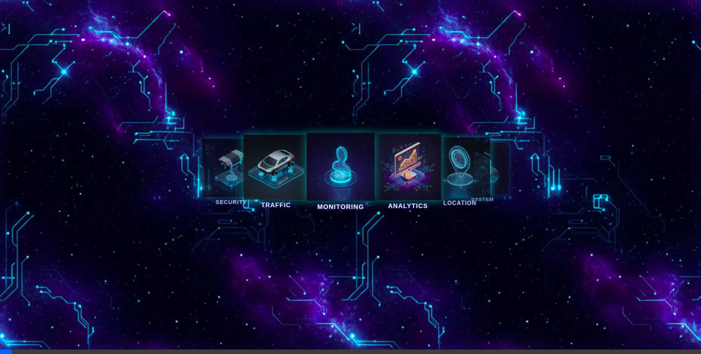
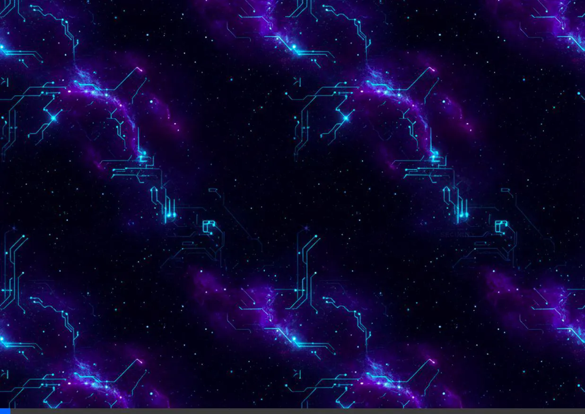

# 3D Carousel Effects

This project demonstrates three different 3D carousel effects using vanilla JavaScript and CSS.

## Arc Carousel

The Arc Carousel arranges items in a semi-circle arc. The items oscillate in a pendulum-like motion.

## Circle Carousel

The Circle Carousel arranges items in a full 3D circle. The items rotate continuously around the center.

## Loop Carousel

The Loop Carousel creates an infinite loop effect where items flow from right to left, disappearing at the end and reappearing at the start.

